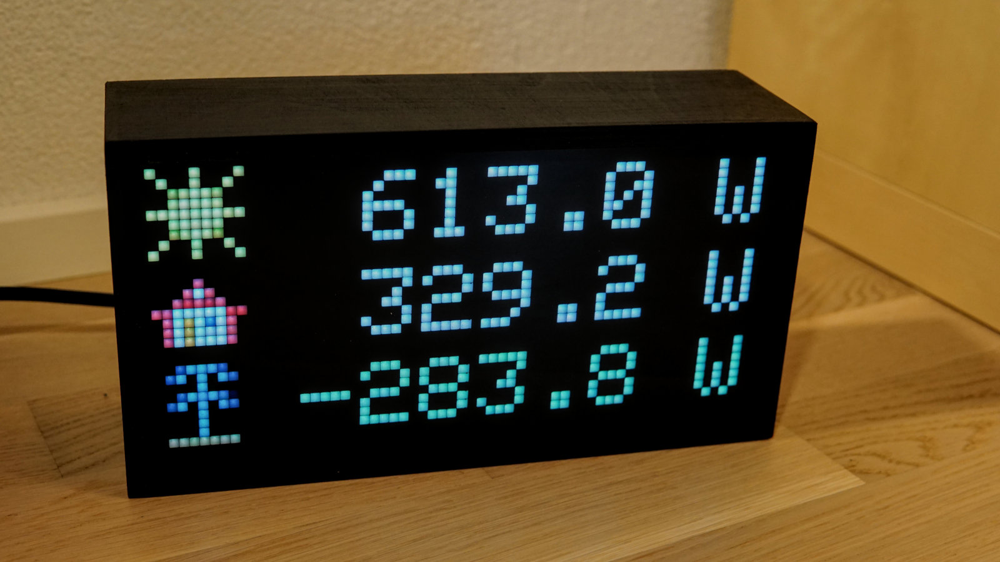
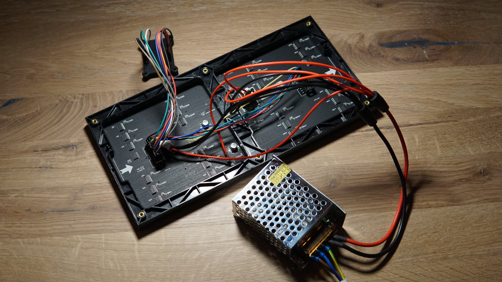
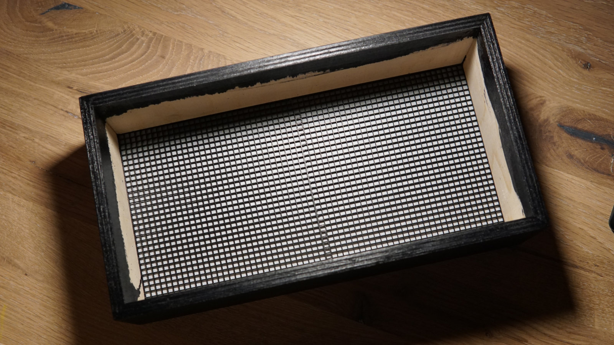

# energymonitor
An ESP8266/Arduino based LED-matrix retro-style energy monitor.

## Hardware Components
* D1 Mini (clone) from AliExpress
* 5V/6A power supply from AliExpress
* 64x32 P4 LED matrix module from AliExpress
* Wooden enclosure, self-made
* 3d printed grid, self-made
* 3mm acrylic sheet glossy black
* baking paper as a diffuser
